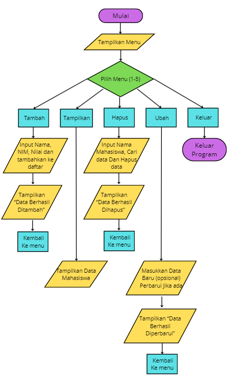
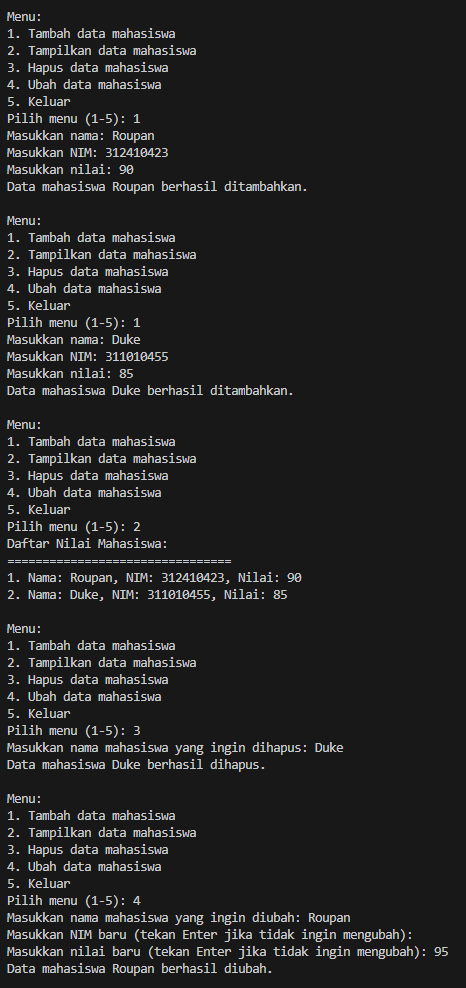
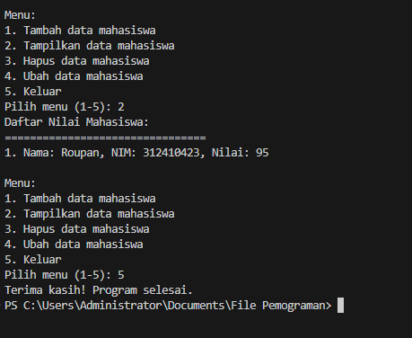

# labpy07

- Nama : Roufan Awaluna Romadhon
- NIM : 31210423
- Kelas : TI.24.A.3

---

## Deskripsi
Program ini adalah implementasi dari sebuah sistem manajemen daftar nilai mahasiswa yang menggunakan bahasa pemrograman Python. Program ini menyediakan fitur untuk menambah, menampilkan, menghapus, dan mengubah data mahasiswa yang terdiri dari nama, NIM, dan nilai. Program ini terdiri dari kelas DaftarNilaiMahasiswa yang menyimpan data mahasiswa dalam bentuk list, dan memungkinkan manipulasi data dengan menggunakan metode-metode tertentu. Pengguna dapat memilih menu untuk menambahkan, menampilkan, menghapus, atau mengubah data mahasiswa melalui antarmuka berbasis teks.

---

## Program Manajemen Data Nilai Mahasiswa

### Deskripsi Program:
Program ini merupakan aplikasi manajemen untuk siswa yang menggunakan Python. Terdiri dari menambah, menampilkan, menghapus, dan mengubah data siswa, seperti nama, ID siswa, dan nilai. Semua data siswa akan disimpan sebagai daftar kamus dengan masing-masing siswa menyimpan nama, ID, dan nilai.

Program khusus ini menginisialisasi instance kelas DaftarNilaiMahasiswa dimana pengguna dapat memilih dari banyak pilihan yang tersedia melalui menu: misalnya menambahkan data siswa baru, menampilkan semua data siswa yang telah diinput, menghapus data siswa berdasarkan nama, dan memodifikasi data baru. atribut untuk data siswa yang ada seperti perubahan ID atau nilai.

Program ini juga dilengkapi dengan penanganan error, misalnya ketika pengguna mencoba memasukkan input nonnumerik saat menambahkan atau mengubah data. Ini kemudian akan memunculkan pesan kesalahan yang menunjukkan apa yang salah. Setiap tindakan yang berhasil (penambahan, penghapusan, atau modifikasi data) akan disertai dengan pesan konfirmasi yang menunjukkan bahwa tindakan tersebut berhasil.

Program ini memiliki antarmuka berbasis teks yang sangat sederhana yang memungkinkan pengguna berinteraksi dengan sistem menggunakan terminal atau konsol.

### Kode Program
Kode program dapat dilihat dibawah ini atau buka file ini [`ClassMahasiswa.py`](ClassMahasiswa.py).
```python
class DaftarNilaiMahasiswa:
    def __init__(self):
        self.data_mahasiswa = []

    def tambah(self, nama, nim, nilai):
        self.data_mahasiswa.append({
            'nama': nama,
            'nim': nim,
            'nilai': nilai
        })
        print(f"Data mahasiswa {nama} berhasil ditambahkan.")

    def tampilkan(self):
        if not self.data_mahasiswa:
            print("Belum ada data mahasiswa.")
        else:
            print("Daftar Nilai Mahasiswa:")
            print("================================")
            for idx, mhs in enumerate(self.data_mahasiswa, start=1):
                print(f"{idx}. Nama: {mhs['nama']}, NIM: {mhs['nim']}, Nilai: {mhs['nilai']}")

    def hapus(self, nama):
        for mhs in self.data_mahasiswa:
            if mhs['nama'].lower() == nama.lower():
                self.data_mahasiswa.remove(mhs)
                print(f"Data mahasiswa {nama} berhasil dihapus.")
                return
        print(f"Data mahasiswa dengan nama {nama} tidak ditemukan.")

    def ubah(self, nama):
        for mhs in self.data_mahasiswa:
            if mhs['nama'].lower() == nama.lower():
                nim = input("Masukkan NIM baru (tekan Enter jika tidak ingin mengubah): ")
                nilai = input("Masukkan nilai baru (tekan Enter jika tidak ingin mengubah): ")
                if nim:
                    mhs['nim'] = nim
                if nilai:
                    try:
                        mhs['nilai'] = int(nilai)
                    except ValueError:
                        print("Nilai harus berupa angka. Data tidak diubah.")
                print(f"Data mahasiswa {nama} berhasil diubah.")
                return
        print(f"Data mahasiswa dengan nama {nama} tidak ditemukan.")


if __name__ == "__main__":
    daftar_nilai = DaftarNilaiMahasiswa()

    while True:
        print("\nMenu:")
        print("1. Tambah data mahasiswa")
        print("2. Tampilkan data mahasiswa")
        print("3. Hapus data mahasiswa")
        print("4. Ubah data mahasiswa")
        print("5. Keluar")
        
        pilihan = input("Pilih menu (1-5): ")

        if pilihan == "1":
            nama = input("Masukkan nama: ")
            nim = input("Masukkan NIM: ")
            try:
                nilai = int(input("Masukkan nilai: "))
                daftar_nilai.tambah(nama, nim, nilai)
            except ValueError:
                print("Nilai harus berupa angka. Data tidak ditambahkan.")
        
        elif pilihan == "2":
            daftar_nilai.tampilkan()

        elif pilihan == "3":
            nama = input("Masukkan nama mahasiswa yang ingin dihapus: ")
            daftar_nilai.hapus(nama)

        elif pilihan == "4":
            nama = input("Masukkan nama mahasiswa yang ingin diubah: ")
            daftar_nilai.ubah(nama)

        elif pilihan == "5":
            print("Terima kasih! Program selesai.")
            break

        else:
            print("Pilihan tidak valid. Silakan coba lagi.")

```

### Penjelasan Program:
Program ini adalah implementasi dari sebuah sistem manajemen daftar nilai mahasiswa menggunakan bahasa pemrograman Python. Program ini menyediakan menu untuk menambah, menampilkan, menghapus, dan mengubah data mahasiswa. Kelas yang digunakan dalam program ini adalah `DaftarNilaiMahasiswa`. Berikut adalah penjelasan masing-masing bagian dari program:

1. **Kelas DaftarNilaiMahasiswa**:
   - **Atribut `data_mahasiswa`**: Ini adalah list yang digunakan untuk menyimpan data mahasiswa berupa dictionary yang berisi 'nama', 'nim', dan 'nilai'.
   - **Metode `__init__`**: Konstruktor yang digunakan untuk menginisialisasi atribut `data_mahasiswa` sebagai list kosong saat objek `DaftarNilaiMahasiswa` dibuat.
   - **Metode `tambah(nama, nim, nilai)`**: Metode ini digunakan untuk menambahkan data mahasiswa baru ke dalam `data_mahasiswa`. Data mahasiswa disimpan dalam bentuk dictionary yang berisi nama, NIM, dan nilai. Jika data berhasil ditambahkan, akan muncul pesan konfirmasi.
   - **Metode `tampilkan()`**: Metode ini digunakan untuk menampilkan daftar semua mahasiswa yang ada dalam `data_mahasiswa`. Jika tidak ada data, akan muncul pesan "Belum ada data mahasiswa."
   - **Metode `hapus(nama)`**: Metode ini digunakan untuk menghapus data mahasiswa berdasarkan nama. Jika nama mahasiswa ditemukan, data mahasiswa tersebut akan dihapus dan muncul pesan konfirmasi. Jika nama tidak ditemukan, akan muncul pesan bahwa data tidak ditemukan.
   - **Metode `ubah(nama)`**: Metode ini digunakan untuk mengubah data mahasiswa berdasarkan nama. Pengguna dapat mengubah NIM dan nilai mahasiswa yang ada, jika tidak ingin mengubah salah satu atribut, pengguna dapat menekan Enter. Jika input nilai bukan angka, akan muncul pesan error.

2. **Bagian `if __name__ == "__main__":`**:
   - Program utama dimulai di sini. Sebuah objek `daftar_nilai` dari kelas `DaftarNilaiMahasiswa` dibuat untuk memulai manajemen data.
   - Program kemudian menampilkan menu pilihan yang memungkinkan pengguna untuk memilih salah satu dari lima pilihan yang ada:
     1. Menambah data mahasiswa
     2. Menampilkan data mahasiswa
     3. Menghapus data mahasiswa
     4. Mengubah data mahasiswa
     5. Keluar dari program
   - Pengguna diminta untuk memilih menu dengan memasukkan angka dari 1 hingga 5. Berdasarkan pilihan, program akan meminta input yang diperlukan dan menjalankan fungsi yang sesuai.
   
3. **Pengolahan Input**:
   - Untuk menu pilihan "Tambah data mahasiswa", program meminta input nama, NIM, dan nilai mahasiswa. Jika nilai yang dimasukkan bukan angka, program akan menampilkan pesan error dan tidak menambahkan data.
   - Untuk menu pilihan "Tampilkan data mahasiswa", program akan menampilkan semua data mahasiswa yang telah ditambahkan.
   - Untuk menu pilihan "Hapus data mahasiswa", program akan meminta nama mahasiswa yang ingin dihapus. Jika nama ditemukan, data akan dihapus.
   - Untuk menu pilihan "Ubah data mahasiswa", program meminta nama mahasiswa yang ingin diubah dan memberikan pilihan untuk mengganti NIM dan nilai mahasiswa tersebut.

4. **Menu Keluar**:
   - Jika pengguna memilih menu "5", program akan mencetak pesan "Terima kasih! Program selesai." dan keluar dari program.

Program ini cukup sederhana namun fungsional, cocok untuk manajemen data mahasiswa dalam skala kecil. Penggunaan input dan output berbasis teks membuatnya mudah digunakan di terminal atau konsol.

### Flowchart:
Flowchartnya adalah sebagai berikut:



### Screenshot Hasil Eksekusi Program:
Berikut adalah hasil eksekusi programnya:


